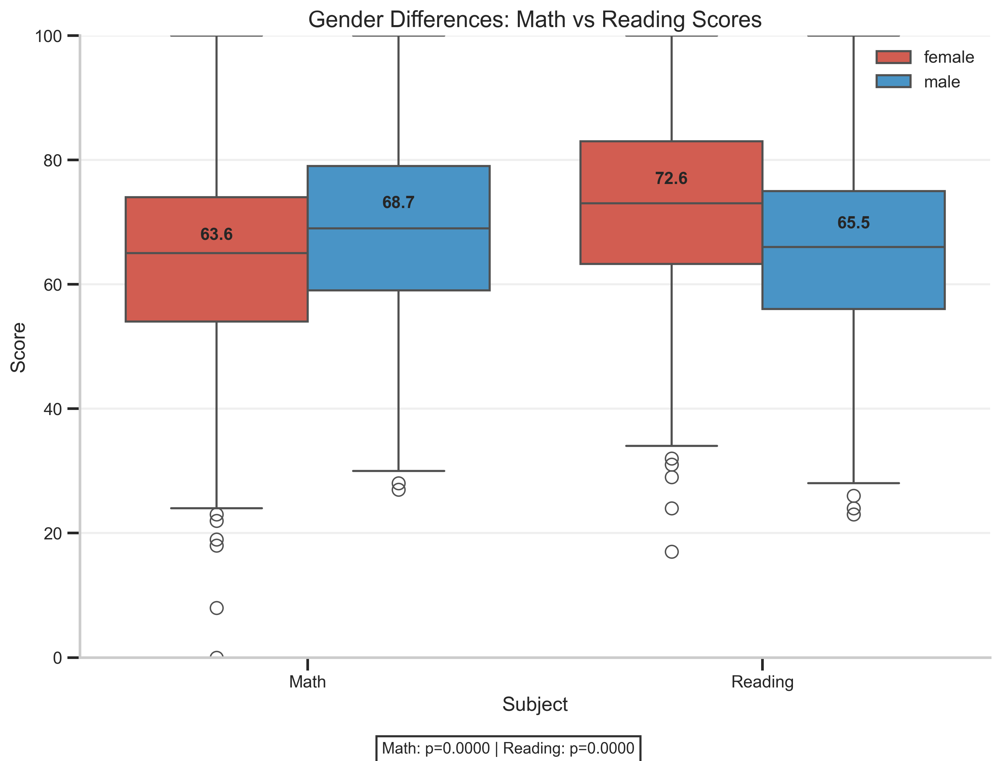
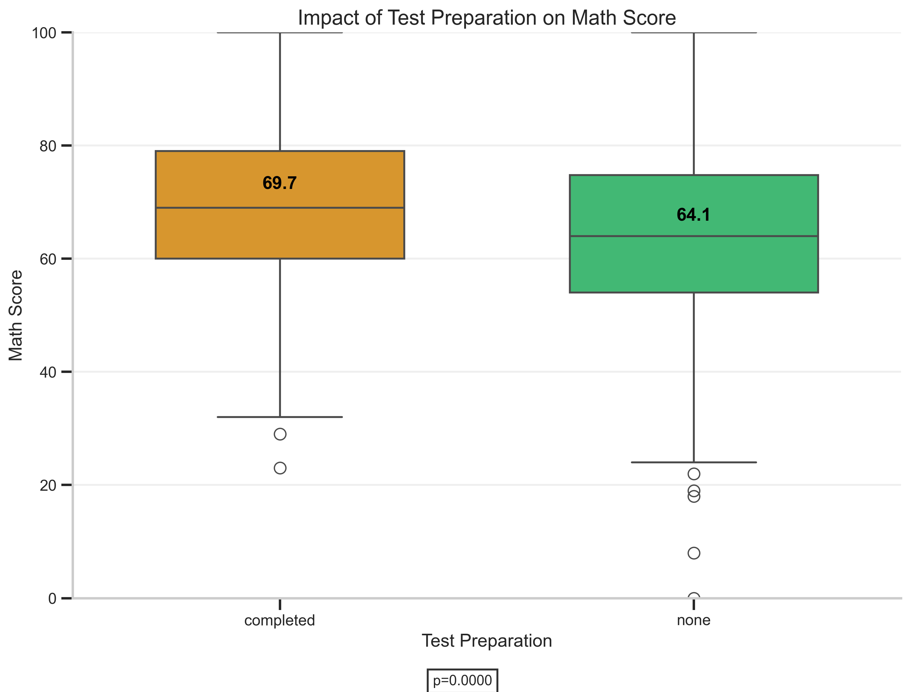
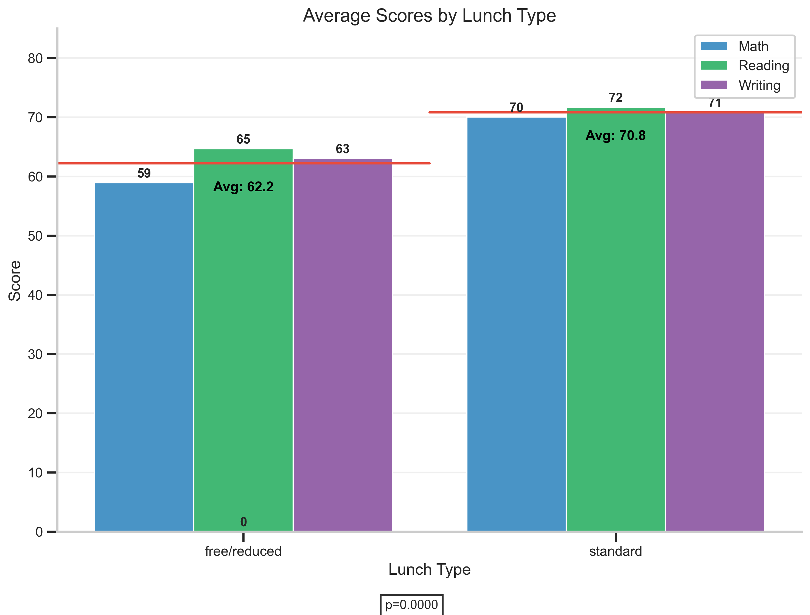
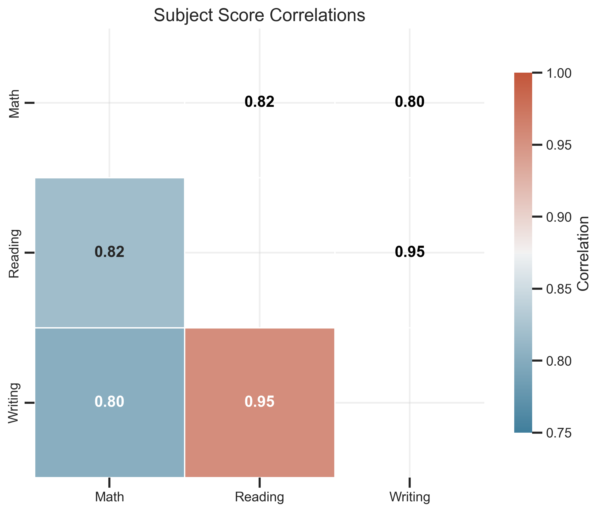

# Student Performance Data Visualization Findings

## Visualization 1: Gender Differences in Math vs Reading Scores

### Question
Are there gender differences in math vs reading?

### Interpretation
The boxplot reveals distinct gender differences in math and reading performance. In math, males score higher on average (68.7 vs 63.6 for females), with a statistically significant difference (p=0.0000). Conversely, in reading, females demonstrate superior performance with a mean score of 72.6 compared to 65.5 for males (p=0.0000). 

The variance in math scores appears comparable between genders, while reading scores show slightly higher variability among males. This gender-based performance pattern aligns with some educational research suggesting gender differences in subject strengths, though individual performance varies widely within each group. These findings highlight potential areas for targeted educational interventions to address gender gaps in subject performance.

## Visualization 2: Test Preparation Impact on Math Scores

### Question
Do students who completed test prep score higher in math?

### Interpretation
The visualization clearly demonstrates that students who completed the test preparation course perform significantly better in math than those who did not. Students with test preparation achieved a mean score of 69.7, compared to 64.1 for those without preparation, representing a 5.6 point or 8.8% improvement (p=0.0000).

The violin plots reveal that the entire distribution of scores shifts upward with test preparation, not just the average. The interquartile range (middle 50% of scores) for students who completed the preparation course is notably higher than for those who didn't. This suggests the test preparation course provides substantial benefits across all performance levels, not just for high or low performers.

The significant statistical difference (p<0.05) confirms that test preparation is likely an important factor in math performance, highlighting the value of structured preparation for standardized tests.

## Visualization 3: Lunch Type and Average Test Performance

### Question
Does lunch type (standard vs free/reduced) relate to outcomes?

### Interpretation
The visualization reveals a consistent and significant relationship between lunch type and academic performance across all subjects. Students with standard lunch consistently outperform those with free/reduced lunch, with an overall average score difference of 8.6 points (70.8 vs. 62.2, representing a 13.9% gap). This difference is statistically significant (p<0.0001).

The performance gap is remarkably consistent across all three subjects (math, reading, and writing), suggesting a systematic relationship rather than a subject-specific phenomenon. Since lunch type is typically related to socioeconomic status, these results highlight how socioeconomic factors may impact educational outcomes across multiple domains.

The consistent pattern across subjects suggests that interventions aimed at addressing educational inequality might need to consider broader socioeconomic factors rather than just subject-specific academic support. These findings align with established research on the relationship between socioeconomic status and academic achievement.

## Visualization 4: Subject Score Correlations

### Question
How strongly do the three subjects move together?

### Interpretation
The correlation heatmap reveals strong positive relationships between all three academic subjects, with correlation coefficients ranging from 0.803 to 0.955. The strongest correlation exists between reading and writing scores (0.955), which is unsurprising given that both subjects rely on similar language skills and verbal reasoning abilities.

Math and reading show a moderate-to-strong positive correlation (0.818), while math and writing exhibit a similar relationship (0.803). These substantial correlations suggest that students who excel in one subject are likely to perform well in the others, indicating that underlying cognitive abilities or educational factors may influence performance across all subjects.

The slightly lower correlations between math and the verbal subjects (reading/writing) compared to the reading-writing correlation align with expectations, as math involves distinct quantitative reasoning skills. These findings suggest that while subject-specific interventions remain important, comprehensive educational approaches targeting fundamental learning skills could benefit performance across all subjects.

## Visualization 5: Math vs Reading Scores with Trend Lines by Test Preparation

### Question
How strongly are math and reading scores associated, and do students who completed the test-preparation course have a different slope in the math-reading relationship?

### Interpretation
The scatter plot reveals a strong positive correlation between reading and math scores for both student groups, with slightly different patterns based on test preparation. Students who completed test preparation (R²=0.63) show a marginally stronger correlation than those who didn't (R²=0.67).

The regression slopes indicate that for every 1-point increase in reading score, students with test preparation see an average 0.84-point increase in math score, while those without preparation see a 0.86-point increase. However, the similar slope values suggest that test preparation affects the overall level of performance rather than fundamentally changing the relationship between reading and math abilities.

Most notably, the intercepts differ substantially (7.6 for prepared students vs. 6.8 for unprepared), indicating that test preparation provides a consistent advantage across all reading ability levels. This "parallel shift" pattern suggests that test preparation techniques may provide general mathematical performance benefits regardless of a student's reading proficiency level.

